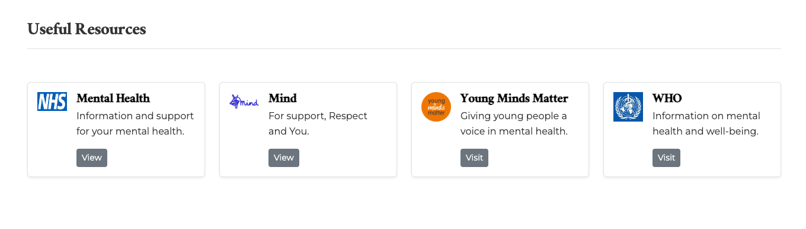

# MindHaven: A Safe Space to Start Your Journey

MindHaven is your go-to platform for accessible, easy-to-understand insights into mental health. We provide beginner-friendly resources to help you identify common mental health challenges, manage stress effectively, and adopt practical strategies for thriving in everyday life.

We offers a warm, inclusive environment for anyone starting their mental health journey. Our mission is to empower you with foundational knowledge, presented in a clear, supportive, and thoughtfully organised way, making it easier than ever to explore and understand key mental health topics.

Responsive View

Wireframes
 - Laptop

 

 - Tablet

 

  - Mobile

 

## Technology Stack

HTML, CSS, and Bootstrap form the robust foundation of the site, delivering a seamless blend of structure, style, and interactivity.

Responsive Excellence with Bootstrap framework - enabling the site to adapt effortlessly to diverse devices and screen sizes, ensuring an intuitive and consistent user experience across all platforms.

## User Stories

- As a site visitor, I want to access a welcoming, calm, and easy-to-navigate website.
- As a user, I want to find information on common mental health issues to help me recognize them in myself and others.
- As a user, I want practical tips on managing mental health issues to improve my well-being and resilience.
- As a user, I want to have access to trusted external resources that can deepen my understanding and provide additional support when needed.
- As a user I want to access a section with positive affirmations that would help strengthened not just my mood but my mind
- As a user, I want to access Mindhaven’s social media pages to stay updated on new articles and keep up with the latest trends.

## Features 

- **Accessible and Engaging Content:** Designed with newcomers in mind, this platform introduces the essentials of mental health awareness, offering clear insights into mental well-being, recognizing common challenges, and practical stress management strategies.

- **Calm and Supportive Visuals**: A soothing, minimalist design with a gentle color palette fosters a serene and stress-free browsing experience.

- **Seamless Navigation**: Built with HTML, CSS, and Bootstrap, the site features an intuitive and well-organized layout, ensuring effortless navigation and enhanced readability for users of all backgrounds.

### Existing Features

- __Navigation Bar__

  - The top navigation bar is fully responsive and contains accessible links to available sections on the website.
  - The navigation bar is fixed at the top so site visitors can easily navigate around the various sections of the website.
  - Bootstrap scrollspy was included to highlight the active section in the navigation based on the user’s scroll position, improving navigation and user experience, especially on single-page websites.

- __The landing page image__

	 - The landing page features a tranquil background image, accompanied by a concise introductory message, and an interactive “Learn More” button designed to engage visitors.
	 - Upon clicking, the “Learn More” button smoothly scrolls down to the resources section, providing users with quick and easy access to valuable mental health information.

- __Common Mental Health Issues Section__
	- Overview of Mental Health Issues: This section highlights three common mental health issues PTSD, Anxiety Disorder, and Personality Disorders by providing brief descriptions of each condition.
	- Informative Visuals: Each mental health issue is paired with a relevant image to visually represent the topic, enhancing engagement and understanding.
	 - Clear Definitions and Symptoms: The content explains the symptoms, causes, and challenges associated with each disorder, helping visitors gain a deeper understanding of these mental health conditions.

- __Mental Health Tips__

  -	Mental Health Tips: This section offers practical advice to support mental well-being, featuring three key tips managing stress, avoiding substance abuse, and practicing self-kindness.
  -	Visual Engagement: Each tip is paired with a relevant image to visually enhance the message and make the advice more relatable and memorable.
  -	Actionable Guidance: The content provides specific, actionable strategies for each tip, encouraging healthy coping mechanisms and promoting positive mental health habits.

- __Positive Affirmations__

  - Positive affirmations are empowering statements that help shift negative thinking, build resilience, and enhance self-compassion

- __Useful Mental Health Resources__

  These resources offer essential support and information, whether you’re looking for advice, guidance, or specialized care.
	-	NHS Mental Health: Offers a wide range of information and support to help manage mental health, providing resources for both prevention and treatment.
	-	Mind: A trusted organization that provides support, guidance, and resources for mental health, with a focus on respect and understanding.
	-	Young Minds Matter: Dedicated to giving young people a voice in mental health, offering resources aimed at supporting youth through mental health challenges.
	-	WHO (World Health Organization): Provides global information and research on mental health and well-being, focusing on mental health awareness and promoting better practices worldwide.

These linked/external resources offer essential support and information, whether a visitor is looking for advice, guidance, or specialized care.

- __The Footer__ 

  - The footer section includes MindHaven copyrights notice and relevant social media links. The links will open to a new tab to allow easy navigation for the user. 
  - The footer is valuable to the user as it encourages them to keep connected via social media.

- __Contact__

  - The contact form appears on a modal when a visitor click the "Contact Us" link that is part of the top bar navigation item. The form would help visitors to easily reach out to MindHaven.

## Testing 

In this section, you need to convince the assessor that you have conducted enough testing to legitimately believe that the site works well. Essentially, in this part you will want to go over all of your project’s features and ensure that they all work as intended, with the project providing an easy and straightforward way for the users to achieve their goals.

In addition, you should mention in this section how your project looks and works on different browsers and screen sizes.

You should also mention in this section any interesting bugs or problems you discovered during your testing, even if you haven't addressed them yet.

If this section grows too long, you may want to split it off into a separate file and link to it from here.

### Validator Testing 

- HTML
  -  errors were returned when passing through the official [W3C validator](https://validator.w3.org/nu/?doc=https%3A%2F%2Fcode-institute-org.github.io%2Flove-running-2.0%2Findex.html)

Trailing slash detected by HTML Validator.The issues were fix.

- CSS
  - No errors were found when passing through the official [(Jigsaw) validator](https://jigsaw.w3.org/css-validator/validator?uri=https%3A%2F%2Fvalidator.w3.org%2Fnu%2F%3Fdoc%3Dhttps%253A%252F%252Fcode-institute-org.github.io%252Flove-running-2.0%252Findex.html&profile=css3svg&usermedium=all&warning=1&vextwarning=&lang=en#css)

  - Contrast Checker

- Lighthouse

### Unfixed Bugs

The few syntax errors detected during the test phase were fixed and re-tested. No bug was left unfixed.

## Deployment

- The site was deployed to GitHub pages. The steps to deploy are as follows: 
  - In the GitHub repository, navigate to the Settings tab 
  - From the source section drop-down menu, select the Master Branch
  - Once the master branch has been selected, the page will be automatically refreshed with a detailed ribbon display to indicate the successful deployment. 

The live link can be found here - https://lindanwajei2205.github.io/mental-health-awareness

## Credits 

### Content 
 - Some of the text content were generated with [ChatGPT](https://chat.openai.com/)
 - Mental health websites linked as resource: 
  [NHS](https://www.nhs.uk/) ,
  [Mind](https://www.mind.org.uk) ,
  [YMM](https://ymm.org.uk/) ,
  [WHO](https://www.who.int/)
 
### Media
 - Icons were taken from  [Font Awesome](https://fontawesome.com/)
 - Fonts were taken from [Google Fonts](https://google.com)
 - Images were taken from [Pixels](https://unsplash.com/), [Google](https://www.google.com/) and [Unsplash](https://unsplash.com/)

### Others
 - Wireframe tool - [Balsamiq](https://balsamiq.com/)